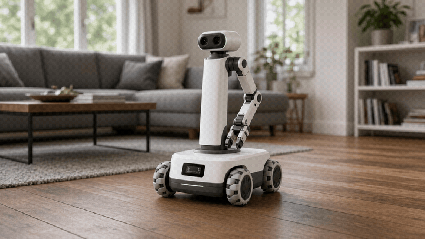
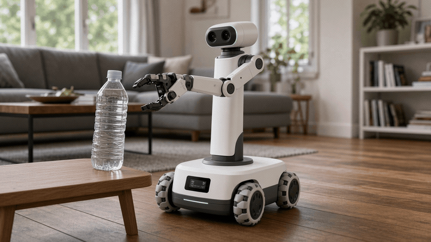
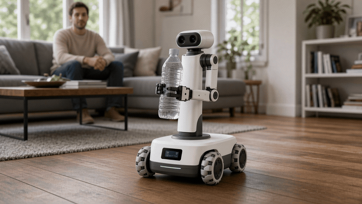
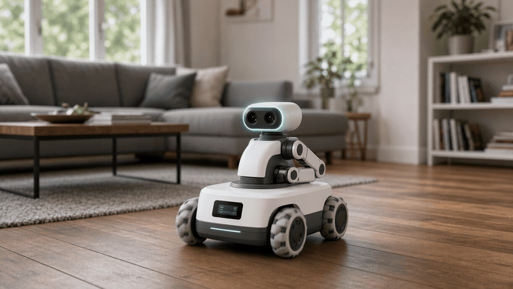
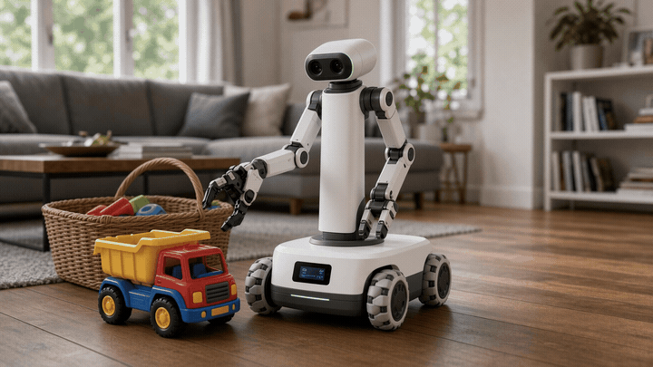
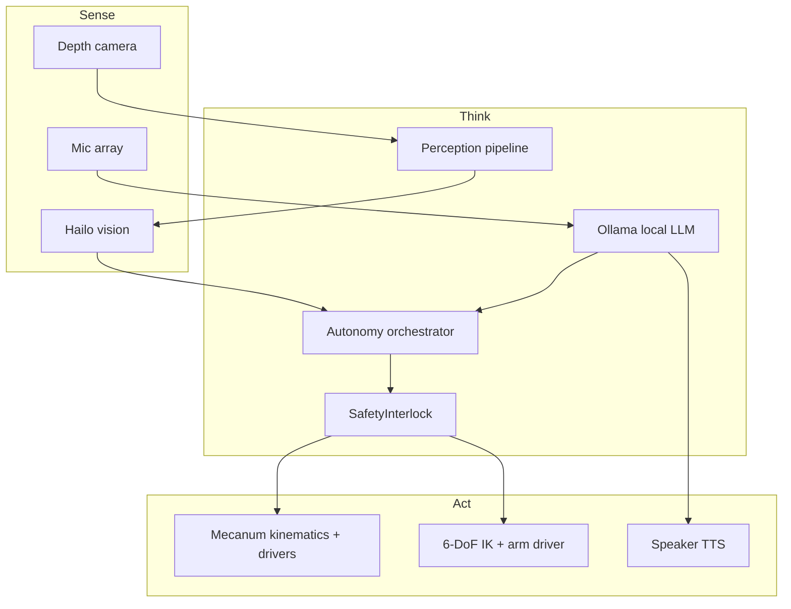

# NestWeaver

**Privacy-first modular home companion robot** — autonomously tidy rooms, fetch small items, and act as a mobile local-LLM interface. No cloud required for core intelligence.

[](https://github.com/btstevens1984az/NestWeaver/actions/workflows/ci.yml)
[](LICENSE)
[](pyproject.toml)
[](nestweaver_ros2/README.md)

---

## Why NestWeaver exists (2026+)

Homes are full of small, repeated chores — cups left on tables, toys on floors, remotes lost in cushions — while most “smart” assistants still ship every utterance to someone else’s data center. Simultaneously, hobbyist robotics finally crossed a practical threshold: **Raspberry Pi 5 + Hailo-class accelerators**, affordable depth cameras, and capable 6-DoF arms can be assembled for roughly the cost of a mid-range laptop.

NestWeaver is an open reference design for a **modular, privacy-first companion** that:

- **Tidies** known clutter into labeled homes (shelf, bin, table).  
- **Fetches** small objects (bottle, remote, toy) with RGB-D grasping hooks.  
- **Talks locally** through on-device **Ollama** — your voice and home map stay on your network.  
- **Fails safe** with real e-stop, soft limits, watchdogs, and battery cutoffs — not brochureware.

It is intentionally **buildable tomorrow**: Python SDK for laptop sim, ROS 2 packages for the robot, BOM + OpenSCAD + wiring docs for hardware.

---

## Product demo visualizations (AI photoreal)

> These GIFs are **AI-generated photorealistic product visualizations** assembled by `scripts/generate_demo_gifs.py` from keyframes under `docs/media/frames/`. They depict the NestWeaver form factor in a real home setting — they are **not** live captures of a shipped unit. Replace with your own field recordings when you have hardware.

### 1. Navigating a living room (obstacle-aware path)



*Omnidirectional base tracing a path around furniture in a home interior (AI photoreal visualization).*

### 2. Picking up a water bottle



*6-DoF arm grasp sequence on a clear water bottle at a side table (AI photoreal visualization).*

### 3. Delivering the bottle



*Fetch-and-carry handover to a person / table (AI photoreal visualization).*

### 4. Voice query while moving (local LLM / Ollama)



*On-device Ollama answering a spoken question while the base continues to navigate (AI photoreal visualization).*

### 5. Tidying / putting an item away



*Clutter item picked from the floor and returned to a basket / shelf home (AI photoreal visualization).*

Regenerate GIFs from committed keyframes:

```bash
.venv/bin/python scripts/generate_demo_gifs.py
```

---

## How the stack fits together

| Layer | Role |
|-------|------|
| **Raspberry Pi 5** | Robot computer — ROS 2, SDK, Ollama (small models), USB peripherals |
| **Hailo AI accelerator** | Low-latency on-device vision (HEF models); CPU stub available for dev |
| **Omnidirectional (mecanum) base** | Holonomic navigation in tight living spaces |
| **6-DoF arm** | Grasp / place for bottles, toys, remotes (SO-ARM-class and similar) |
| **Depth camera** | RGB-D perception (RealSense-class) for detect → deproject → grasp |
| **Safety interlocks** | E-stop, soft limits, collision, battery, watchdogs, geofence, child/pet |
| **Ollama** | Local LLM for voice intents and explanations — no cloud required |



Deeper diagrams: [`docs/architecture.md`](docs/architecture.md) · wiring: [`docs/wiring.md`](docs/wiring.md) · safety: [`docs/safety.md`](docs/safety.md)

---

## Day-1 quickstart (no hardware)

```bash
git clone https://github.com/btstevens1984az/NestWeaver.git
cd NestWeaver
python3 -m venv .venv && source .venv/bin/activate
pip install -e ".[dev,sim]"
nestweaver doctor
nestweaver sim-demo --scenario all
pytest -q
```

Docker:

```bash
docker compose up --build
```

---

## Installation & setup

| Platform | Guide |
|----------|-------|
| Windows | [`docs/setup/windows.md`](docs/setup/windows.md) |
| macOS | [`docs/setup/macos.md`](docs/setup/macos.md) |
| Linux | [`docs/setup/linux.md`](docs/setup/linux.md) |
| Docker | [`docs/setup/docker.md`](docs/setup/docker.md) |
| Pure CLI | [`docs/setup/cli.md`](docs/setup/cli.md) |
| PowerShell | [`docs/setup/powershell.md`](docs/setup/powershell.md) |

### ROS 2 (Humble / Jazzy)

```bash
source /opt/ros/$ROS_DISTRO/setup.bash
cd nestweaver_ros2
rosdep install --from-paths src -y --ignore-src
colcon build --symlink-install
source install/setup.bash
ros2 launch nestweaver_bringup nestweaver.launch.py
```

### Local LLM (Ollama)

```bash
ollama pull llama3.2:3b
nestweaver chat "Help me plan a tidy of the living room"
# or offline echo:
nestweaver chat --offline "Where is the bottle?"
```

---

## Repository map

```
NestWeaver/
├── src/nestweaver/          # Installable Python SDK
│   ├── safety/              # E-stop, limits, watchdogs (tested)
│   ├── base/                # Mecanum kinematics + driver stubs
│   ├── arm/                 # 6-DoF IK interface stubs
│   ├── perception/          # RGB-D pipeline outline
│   ├── hailo/               # Accelerator hooks (+ CPU stub)
│   ├── llm/                 # Ollama client
│   ├── voice/               # STT/TTS session stubs
│   ├── autonomy/            # Navigate / fetch / tidy / voice
│   └── cli/                 # `nestweaver` command
├── nestweaver_ros2/         # ROS 2 packages + launch
├── configs/                 # Robot, room, safety YAML
├── bom/BOM.md               # Bill of materials
├── docs/                    # Architecture, wiring, CAD, media, setup
├── hardware/                # Pin map + power budget
├── scripts/                 # Install, sim, GIF generator, calibrate
└── tests/                   # Safety + kinematics + autonomy tests
```

---

## Hardware

- **BOM (prices, vendors, PNs):** [`bom/BOM.md`](bom/BOM.md)  
- **Pins & power:** [`hardware/README.md`](hardware/README.md)  
- **Printable CAD (OpenSCAD):** [`docs/cad/`](docs/cad/)  

Typical prototype budget: **~$1,100–2,400** depending on arm and camera choices.

---

## Safety first

Before enabling motor power:

1. Run `pytest -q` and `nestweaver doctor`.  
2. Verify hard e-stop cuts motor power with software **unplugged**.  
3. Jack the base so wheels cannot translate on first cmd_vel tests.  
4. Read [`docs/safety.md`](docs/safety.md).

NestWeaver provides **real interlock code** (`SafetyInterlock`) and tests — it does **not** claim certified functional safety.

---

## CLI cheatsheet

```bash
nestweaver doctor
nestweaver sim-demo --scenario fetch|tidy|voice|all
nestweaver safety-status
nestweaver chat "..." 
nestweaver chat --offline "..."
nestweaver show-config configs/robots/nestweaver_alpha.yaml
```

---

## Contributing

See [`CONTRIBUTING.md`](CONTRIBUTING.md) and [`CODE_OF_CONDUCT.md`](CODE_OF_CONDUCT.md). Security reports: [`SECURITY.md`](SECURITY.md).

## License

Apache License 2.0 — see [`LICENSE`](LICENSE).

---

Built for people who want a helpful home robot **without** surrendering their living room to the cloud.
