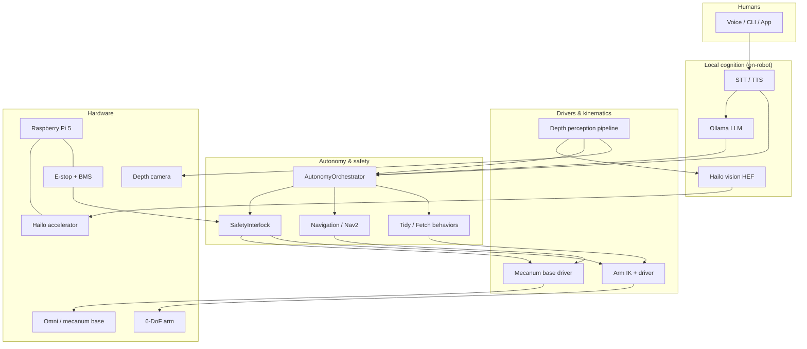

# Architecture

NestWeaver splits into three cooperating layers:

1. **Hardware** — Pi 5 + Hailo, mecanum base, 6-DoF arm, depth camera, e-stop/power  
2. **Edge software** — Python SDK (`nestweaver`) for sim/dev + safety; ROS 2 packages for robot bringup  
3. **Local cognition** — Ollama LLM + optional on-device Hailo vision (no cloud required)

## Data flow (fetch bottle)

1. Perception captures RGB-D → Hailo (or stub) detects `bottle` → deprojects XYZ.  
2. Safety validates EE pose and joint soft limits.  
3. Arm IK solves grasp; gripper closes.  
4. Nav2 / orchestrator drives to delivery waypoint with collision + geofence checks.  
5. Place pose → open gripper. Optional voice confirmation via Ollama.

## Why both ROS 2 and a pure Python SDK?

- **ROS 2** — production robot runtime, Nav2, bag recording, multi-node isolation.  
- **Python SDK** — Day-1 laptop demos, unit tests, CI, and hardware bring-up scripts without sourcing an entire workspace.
