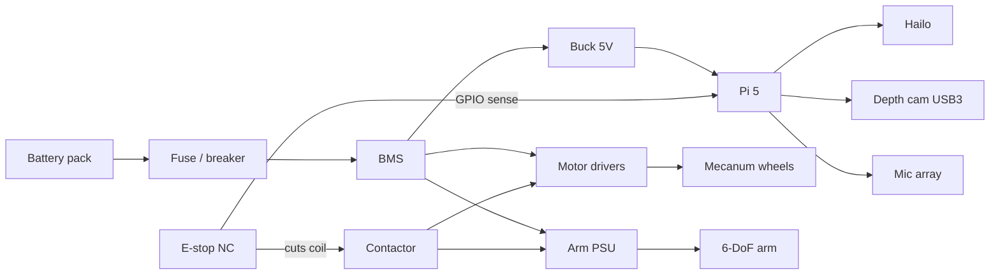

# Wiring

## ASCII overview

```
                     +----------------------+
   Depth Cam USB3 -->|                    |<-- USB mic / speaker
                     |   Raspberry Pi 5     |
   Hailo HAT/M.2 ----|   (+ active cool)    |---- GPIO17 E-STOP SENSE
                     |                      |---- GPIO27 MOTOR_ENABLE
                     +----------+-----------+
                                |
                         5V buck from pack
                                |
   PACK+ --FUSE-- BMS --+-------+--------> Arm DC-DC --> 6-DoF Arm
                        |
                        +-- Motor Drivers --> Mecanum FL FR RL RR
                        |
   PACK- ---------------+  (star ground)
                        |
                   E-STOP contactor in motor + arm high-current path
```

## Mermaid wiring



## Best practices

- Separate logic ground star-point from high-current motor returns at the BMS.  
- Twisted pairs for encoder lines; keep away from motor phase wires.  
- Strain-relief all cables at the mast and arm base.  
- Label both ends; document any GPIO remaps in `hardware/README.md`.
